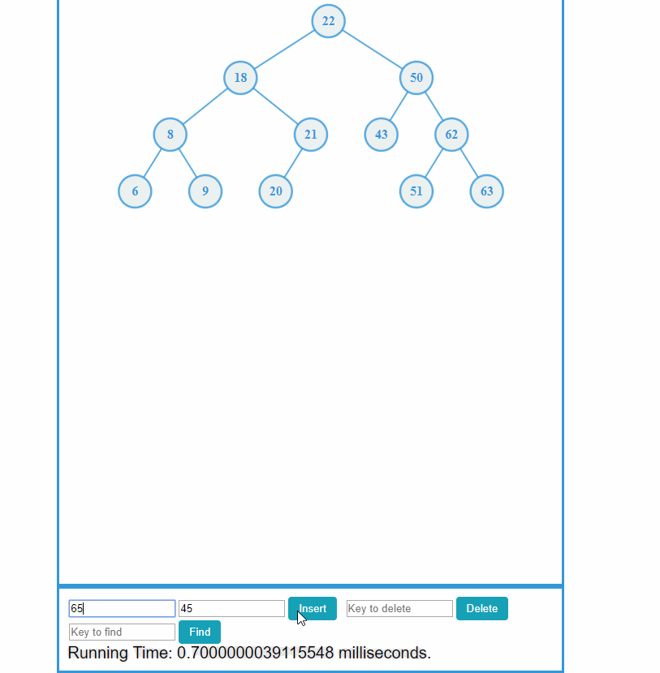

# CSE204 Project3

## Requirement (copy from coursework)

Write an applet or stand-alone graphical program that animates an AVL tree. Your program should support all the AVL tree operations (search, insert, remove).

Since the AVL Java code is already in our text book, your program should also support the methods (search, insert, remove) of the ordered dictionary ADT using the AVL tree. Perform a careful experimental analysis of the running times for your insertion and removal procedures of the ordered dictionary ADT. Plot their running times as a function of the input size and discuss whether observed curves can be expected by the theoretical analysis.

## Demo

This demo follows part of the [video tutorial](https://www.youtube.com/watch?v=7m94k2Qhg68) and I encourge you to watch the tutorial as well. Let's get our hands dirty.

1.  Insert (43,)
2.  Insert (18,)
3.  Insert (22,) -> left-right rotation
4.  Insert (9,)
5.  Insert (21,)
6.  Insert (6,) -> right rotation
7.  Insert (8,) -> left-right rotation
8.  Insert (20,)
9.  Insert (63,)
10. Insert (50,) -> right-left rotation
11. Insert(62,) -> left rotation
12. Insert (51,) -> right rotation

And still balanced, whooray!

## Notes

* The value is not not necessary but for assginment only (to simulate an ordered dictionary ADT)
* Need to have key to insert/delete/search

## Some tutorials on AVL Tree:

* http://btechsmartclass.com/DS/U5_T2.html
* https://ocw.mit.edu/courses/electrical-engineering-and-computer-science/6-006-introduction-to-algorithms-fall-2011/lecture-videos/lecture-6-avl-trees-avl-sort/
