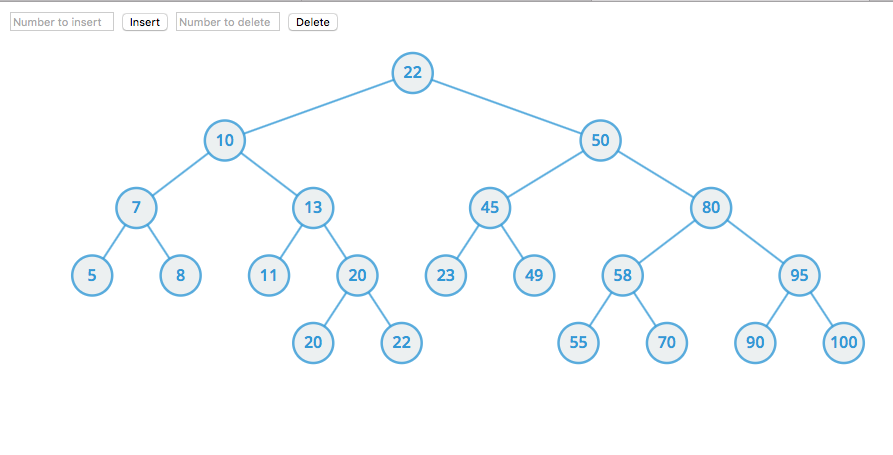

# CSE204 Project3

## Requirement

Write an applet or stand-alone graphical program that animates an AVL tree. Your program should support all the AVL tree operations (search, insert, remove).

Since the AVL Java code is already in our text book, your program should also support the methods (search, insert, remove) of the ordered dictionary ADT using the AVL tree. Perform a careful experimental analysis of the running times for your insertion and removal procedures of the ordered dictionary ADT. Plot their running times as a function of the input size and discuss whether observed curves can be expected by the theoretical analysis. 

## Implementation

* Javascript

